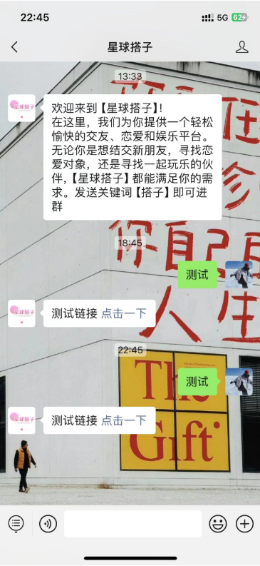
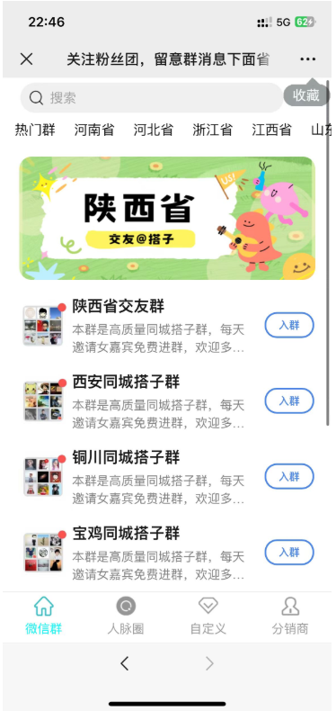
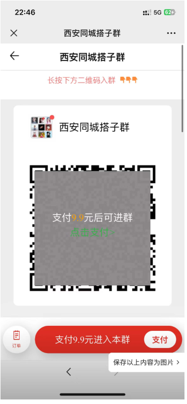
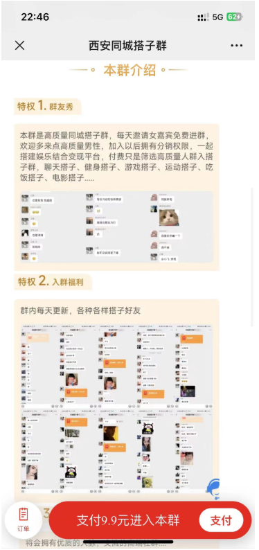

# 搭子社群 🤝

**搭子社群** 是一个致力于帮助用户将公域流量转化为私域流量的社群项目。我们通过微信公众号将用户引导到私域流量池，实现精准用户管理和高效转化。我们的目标是为您提供一个高质量的社群平台，使您能够从大量的公域流量中筛选出高价值用户，提升用户粘性和转化率。🚀

## 项目概述

### 什么是公域流量与私域流量？

- **公域流量**：指的是开放的、广泛的互联网流量，通常通过搜索引擎、社交媒体等平台获取。
- **私域流量**：指的是用户在您的私有平台（如微信群、社群等）内的流量，可以长期管理和互动。

通过将公域流量转化为私域流量，我们能够更好地管理和维护用户关系，提高用户的留存率和转化率。

### 项目亮点

1. **微信公众号流量转接**：
    - 我们利用微信公众号作为流量转接的桥梁，通过优质内容吸引用户关注，逐步引导用户进入我们的社群。📲

   

2. **付费进群系统**：
    
- 引入付费进群系统，确保社群的高质量和用户的付费意愿。付费机制不仅可以过滤低质量用户，还可以提升社群的专业性和活跃度。💰
   
  
    
      
    
      
    
3. **高效用户管理**：
    - 通过系统化的管理工具和策略，我们能够精细化管理社群用户，提供个性化服务，提升用户体验。🛠️

### 加入搭子社群的好处

- **精准用户**：获取高价值用户，提升营销效果。
- **优质互动**：在私域流量池中进行深度互动，增强用户粘性。
- **持续增长**：通过有效的社群运营策略，促进用户的持续增长和活跃。

## 如何加入？

1. **关注我们的微信公众号**：获取最新项目和资讯，了解更多关于搭子社群的信息。📱

2. **扫描二维码**：进入我们的社群，体验高质量的互动和管理。📲

   展示二维码图片 todo

### 联系我们

如有任何疑问或需要进一步了解我们的项目，请通过以下方式与我们联系：

- **邮箱**： 📧
- **网站**： 🌐

---

**搭子社群** 团队
